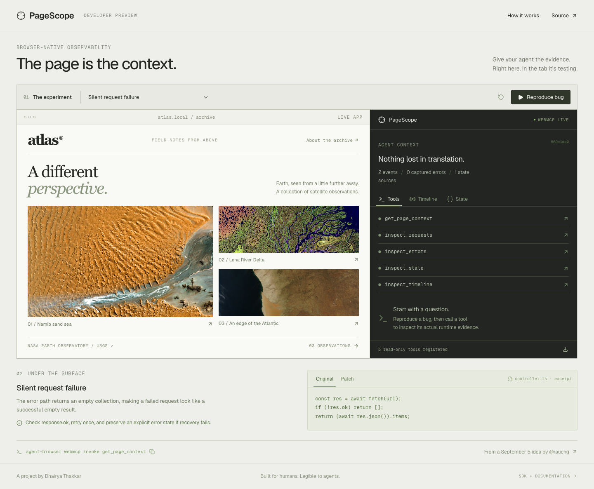

# PageScope

**The page is the context.** Page-local debugging tools for browser agents, with a working Next.js demo.

Inspired by [Guillermo Rauch’s September 5, 2026 post](https://x.com/rauchg/status/2096065378598441431) proposing debugging tools exposed by the particular page an agent is testing.

PageScope captures **opt-in state, request metadata, errors, and ordered events**, then exposes five read-only tools through the browser’s native WebMCP registry. No separate MCP server. No API key. No telemetry backend.

The demo is an editorial satellite archive with three real, controlled failure cases. Reproduce a bug, inspect the runtime evidence, switch to a documented patch, and rerun the experiment.



## Try it

```bash
npm ci
npm run dev:next
# http://localhost:3001
```

Node 24 recommended (minimum 22.13). The public demo runs official Next.js on Vercel. `npm run dev` and `npm run build` retain a Vinext/Cloudflare path for the secondary Sites deployment. Both builds use the same React application and API fixtures.

1. Select **Out-of-order search** and **Reproduce bug**.
2. The input says `lena`, while the results belong to `namibia`.
3. Call `inspect_state`, then `inspect_timeline`. The older response overwrote the new intent.
4. Select **Apply fix & verify**. The generation guard discards the stale result.
5. Export the actual trace as JSON.

“Apply fix” switches between prewritten implementations shown in the code panel. It does **not** claim to generate or edit code autonomously. Deliberate HTTP failures and latency are test fixtures, labeled as such in the source.

## Use it with an agent

Install [Vercel’s agent-browser](https://github.com/vercel-labs/agent-browser) and its Chrome for Testing runtime:

```bash
npx agent-browser install
npx agent-browser --session pagescope open http://localhost:3001
npx agent-browser --session pagescope webmcp list
npx agent-browser --session pagescope webmcp invoke get_page_context --params '{}'
npx agent-browser --session pagescope webmcp invoke inspect_requests --params '{"limit":10}'
```

Native WebMCP is experimental. PageScope feature-detects `document.modelContext.registerTool`. The demo’s inspector remains functional in unsupported browsers by calling the same validated executor locally; that fallback is labeled and is not a WebMCP polyfill. Native discovery and invocation have a separate verification script.

## Quick start

The reusable package is in [`packages/pagescope`](packages/pagescope). Build and package it locally (not published to npm yet):

```bash
npm run build:sdk
npm pack ./packages/pagescope
# In your app: npm install /path/to/dhairya-t-pagescope-0.1.0.tgz
```

```tsx
'use client';
import { useEffect, useMemo, useState } from 'react';
import { PageScope } from '@dhairya-t/pagescope';
import { PageScopeProvider, useInspectState, useWebMCP } from '@dhairya-t/pagescope/react';

export function DebugSurface({ children }: { children: React.ReactNode }) {
  const [scope] = useState(() => new PageScope({ capacity: 120 }));
  useEffect(() => { scope.enterPage(window.location.pathname); }, [scope]);
  useWebMCP(scope); // registers read-only tools; aborts registrations on unmount
  return <PageScopeProvider scope={scope}>{children}</PageScopeProvider>;
}
```

Instrument selected calls with `scope.fetch(url, init)`. Use `scope.setState('Search', { query, count })` or `useInspectState` for explicit state sources. Use `PageScopeBoundary` around components to capture React errors. On an SPA route transition call `scope.enterPage(pathname)`; this clears previous state and prevents older in-flight requests from contaminating the new trace.

Enable the provider only in development or in a deliberately public fixture like this demo. A production application should wrap it behind its own environment or authorization gate. The SDK does not infer your authorization policy.

## What is exposed

| Tool | Output |
| --- | --- |
| `get_page_context` | Page ID, route, counts, latest captured error |
| `inspect_requests` | Correlated request/response events, status, measured duration |
| `inspect_errors` | Captured errors with explicitly supplied source labels |
| `inspect_state` | Explicitly registered state after bounded sanitization |
| `inspect_timeline` | Ordered actions, requests, state changes, errors, discards |

All tools validate input at execution time. `limit` is an integer from 1 to 50. Read-only annotations are accurate: tool calls do not add events or mutate app state. Application values are marked untrusted content.

## Design and tradeoffs

- **One context per tab/page view.** UUID identities, monotonic sequence numbers, generation isolation for late requests.
- **Bounded retention.** Default 120 events, maximum 1,000; up to 24 state sources. Each record has an 8KB JSON budget with bounded depth, array length, and string length. Ring eviction is reported, not hidden.
- **Opt-in instrumentation.** No patching of global fetch, console, React internals, cookies, or local storage. HTTP bodies, headers, and query strings are never recorded by the fetch wrapper.
- **Sanitize before retention.** Common sensitive field names, bearer strings, and email-like values are redacted. This is a best-effort backstop, not a guarantee that arbitrary text is safe. Register only the fields you intend to expose.
- **No background persistence.** Transient debugging evidence belongs to the current page; reload clears it. Export JSON if you want a durable artifact.
- **No server debugger replacement.** Next.js already has [`next-devtools-mcp`](https://nextjs.org/docs/app/guides/mcp). PageScope adds a small opt-in browser surface and complements those server-side diagnostics.

See [architecture](docs/architecture.md), [research](docs/research.md), [verification](docs/verification.md), and [image credits](public/images/CREDITS.md).

## Verification

```bash
npm run check                 # TypeScript, SDK tests, SDK compilation
npm run build:vercel
npm run start:next            # in another terminal
TEST_BASE_URL=http://localhost:3001 npm run test:e2e
TEST_BASE_URL=http://localhost:3001 npm run test:webmcp
```

The browser suite should target a **production** server: development error overlays intentionally interrupt the render-crash fixture. The suite waits for hydration, not arbitrary sleeps. On Linux/CI run `npx playwright install --with-deps chromium`; on macOS it detects Chrome installed by agent-browser, or accepts `CHROME_PATH`.

## License and credits

MIT. Built by [Dhairya Thakkar](https://github.com/dhairya-t).

NASA/USGS imagery is used with attribution. The archive contains two Landsat false-color images and one MODIS natural-color image; these are not generated images. Typography and density take cues from [Vercel’s design work](https://vercel.com/design), [Linear](https://linear.app), and [Teenage Engineering’s field system](https://teenage.engineering/products/field-system), with an original editorial composition.
