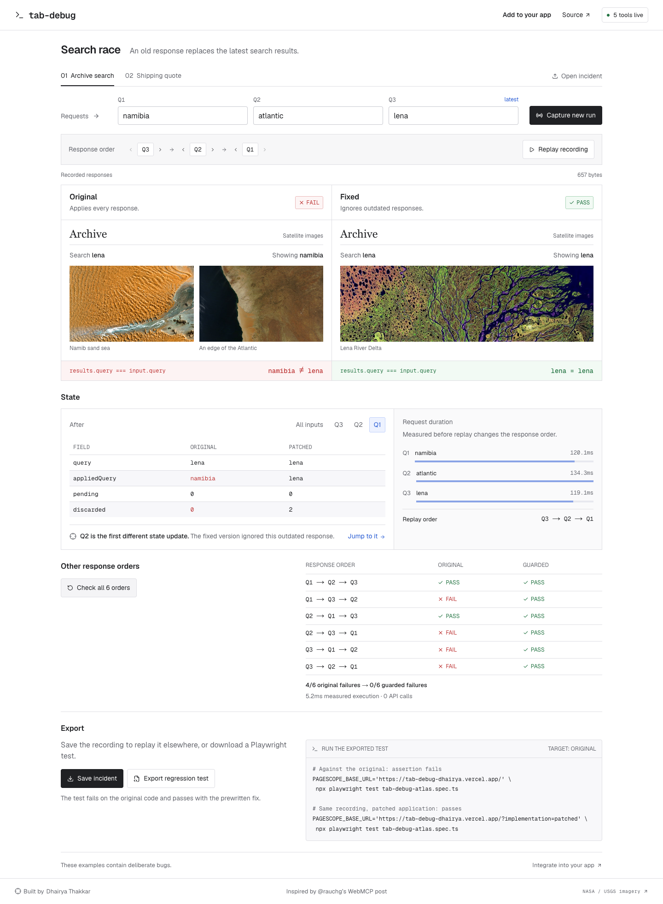

# tab-debug

Browser debugging tools that live in your Next.js page. An agent can read that tab's requests, errors, and application state through WebMCP, without a separate MCP server.

[Add to your app](https://tab-debug-dhairya.vercel.app/setup) · [Live demo](https://tab-debug-dhairya.vercel.app) · [Minimal Next.js app](examples/next-app) · [API reference](packages/tab-debug)

Built from [Guillermo Rauch’s proposal](https://x.com/rauchg/status/2096065378598441431) for debugging tools exposed by the specific tab an agent is testing.

## Add it to Next.js

Install the release archive. The package is not on the npm registry yet.

```bash
npm install https://tab-debug-dhairya.vercel.app/downloads/dhairya-t-tab-debug-0.3.0.tgz
```

Wrap your existing layout:

```tsx
import { TabDebug } from '@dhairya-t/tab-debug/next';

export default function RootLayout({ children }: { children: React.ReactNode }) {
  return <html lang="en"><body><TabDebug>{children}</TabDebug></body></html>;
}
```

This registers the browser tools in development, captures metadata for subsequent browser fetches and uncaught errors, and clears page context on pathname changes. It renders no UI. Production builds disable it by default.

Optionally share selected state inside a client component:

```tsx
import { useDebugState } from '@dhairya-t/tab-debug/react';

useDebugState('Search', { query, resultCount: results.length, loading });
```

Then, with your development server running and a WebMCP-capable browser installed:

```bash
npx agent-browser open http://localhost:3000
npx agent-browser webmcp list
npx agent-browser webmcp invoke inspect_state --params '{}'
```

The five tools are `get_page_context`, `inspect_requests`, `inspect_errors`, `inspect_state`, and `inspect_timeline`. They are read-only. No request headers, query values, or bodies are retained. No telemetry or backend is used.

[Full setup and working example](https://tab-debug-dhairya.vercel.app/setup). The example installs and imports the same archive served by the command above.

## A real UI bug

We reproduced an existing bug in [Transform](https://github.com/ritz078/transform): use **Load File → Fetch URL**, correct a URL while its download is pending, and the slower first download can overwrite the newer selection. Both requests return 200, but the editor shows the wrong file. The public walkthrough illustrates this with staging and production JSON in a working JSON-to-YAML view. Those sample names describe a plausible user mistake, not a reported user incident. You can watch the sequence or operate the URL loader yourself, then read the actual WebMCP state and response history.

The [live demo](https://tab-debug-dhairya.vercel.app) reduces this to one button, two requests, and the editor value. **Read state** and **Read requests** call the same tools exposed to browser agents. **Run with fix** checks a request number before applying a response.

[Full upstream reproduction, pinned source, license, and small fix](examples/transform). We first verified the bug in the unmodified app, then added tab-debug and independently checked its state against the rendered editor. The patched app keeps the correct file. Only response timing and fixture JSON are controlled; the bug was not injected.

## Optional replay experiments

The [search example](https://tab-debug-dhairya.vercel.app/replay) deliberately lets an old response overwrite newer results. Select **Capture & compare** to run the original handler and a prewritten fix against the same responses. Inspect state after each response, try all six completion orders, or export a recording and Playwright test.

The default inputs produce four failing orders on the original and none on the fixed handler. Change the response order and the result can change. This is the one optional second example on the site. The previous three-scenario Atlas screen and standalone shipping demo now redirect to the retained demos.



Replay is optional and requires an adapter around your real async handler. It is not automatically enabled by `TabDebug`. [Replay integration guide](docs/replay.md).

## What it covers

- Browser `fetch` calls made after the provider mounts, uncaught errors, unhandled promise rejections, and explicitly registered state.
- Per-page bounded history, redaction, tool input validation, and cleanup on unmount.
- Framework-independent core, optional React bindings, and a Next.js App Router component.
- Portable recordings and test generation through the separate replay API and `tab-debug` CLI.

It does not automatically capture server-side fetches, XMLHttpRequest, all React internals, or errors already handled by a boundary. Native WebMCP is experimental and requires compatible browser tooling. Redaction is a backstop: register only safe fields. The demo uses known fixtures and prewritten fixes; it does not generate source-code repairs.

The original `pagescope.incident.v1` format and `__PAGESCOPE_REPLAY__` bridge names remain compatible with older recordings.

## Develop and verify

Node 24 recommended (minimum 22.13).

```bash
npm ci
npm run dev:next             # localhost:3001
npm run check               # types, unit tests, SDK compilation
npm run build:vercel
npm run start:next
npm run test:e2e
npm run test:export          # same test fails before the fix, passes after
npm run test:webmcp          # native agent-browser integration
```

The main deployment runs Next.js on Vercel. `npm run build` retains the secondary Vinext/Cloudflare build. [Verification](docs/verification.md), [architecture](docs/architecture.md), [research](docs/research.md).

MIT. Built by [Dhairya Thakkar](https://github.com/dhairya-t). [NASA/USGS image credits](public/images/CREDITS.md).
