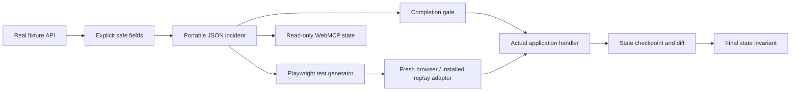
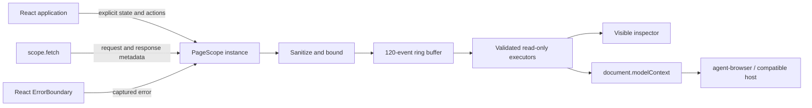

# Architecture

## Next.js integration

`TabDebug` from the `/next` package entry uses the current pathname and wraps the existing children in a React provider. It activates only when `NODE_ENV` is `development`, unless explicitly overridden. It renders no DOM and does not remount the application on navigation.

The provider installs a temporary `window.fetch` wrapper and listeners for uncaught errors and unhandled rejections. Fetch passes the original input and init through unchanged, retaining only method, path, status, and duration. A `Request` body is never consumed by the recorder. Teardown restores the original fetch only if it still owns the global slot, removes listeners, aborts tool registrations, and invalidates late diagnostic writes.

`useDebugState` exposes explicitly selected values. Pathname changes clear the previous page's context and trigger state hooks to register the still-mounted component's current values. The independent [Next.js example](../examples/next-app) verifies this using a counter retained across two routes. The public setup form imports the SDK from the actual release archive.

The low-level opt-in interfaces below remain available. Replay is a separate integration and is not installed by the Next.js component.

## Deterministic replay

The archive and shipping quote examples use independent async application handlers. Each dispatch starts synchronously and awaits a completion promise. The gate controls when that promise resolves, then waits for the handler before recording the checkpoint. Recorded outputs, rather than a live API, supply replay values. The scheduler is framework-independent and the rendering layer consumes its actual checkpoint states.

The replay runner validates the incident before dispatch, deep-clones inputs and snapshots, bounds snapshot size, and supports cancellation/deadlines while awaiting handlers. Snapshot diffs identify the first differing business-state update. Schedule enumeration is exhaustive only over the recorded operations' completion orders, with all inputs issued first.

The exported test embeds the recording, invokes an explicitly installed test adapter in a fresh browser, and independently asserts the selected state fields. The adapter rejects an incident for a different app ID. No source code in an incident is evaluated. See [the complete contract and limitations](replay.md).

## Page-local diagnostics

## Correlation and lifetimes

Request-start sequence IDs act as correlation IDs for response events. Durations use `performance.now()`; the event clock uses `Date.now()`. Event ordering is defined by sequence IDs, not wall-clock timestamps.

`enterPage` increments a generation, generates a new UUID, and clears events and state. Each in-flight fetch captures its starting generation. Completion is recorded only when that generation still matches. This is isolation of diagnostic writes; the caller remains responsible for cancelling requests or suppressing stale business-state updates. The race experiment demonstrates a separate application-level generation guard.

WebMCP tools are registered once with an AbortSignal. Unmounting the integration aborts registrations; disposed executors also reject late calls. Every executor reads the current scope rather than closing over an old snapshot. An unsupported browser receives no fake native API.

State and events are sanitized before they enter the buffer. Snapshots are deep copies so callers cannot mutate the retained records. Unchanged state values do not emit new events. The subscription API exposes a monotonically increasing version for `useSyncExternalStore`.

## Reproduction cases

| Case | Real failing behavior | Patch behavior | Evidence |
| --- | --- | --- | --- |
| Silent request failure | Fixture returns HTTP 503; original path treats it as an empty collection | One bounded retry receives HTTP 200, restoring items | Correlated request/response events, status codes, item counts |
| Out-of-order search | Both real requests start together; a completion gate delivers Namibia after Lena, overwriting newer results | Per-search generation check discards the stale result | Query versus applied query; measured transport and explicit delivery events; discard event |
| Nullable metadata | Fixture returns null title; original component throws during render | Nullish fallback before uppercase conversion | React boundary error; original nullable state; safe rendered output |

The public API fixture accepts a small fixed set of cases and an optional bounded search string. It does not proxy user URLs, execute uploaded code, invoke models, or write persistent records.

## Framework boundaries

The core package has no React or server dependency. The React entry point provides a provider, subscription hook, explicit state hook, registration hook, and boundary. The browser is the only WebMCP registration boundary.

Official Next.js 16 handles the public Vercel deployment. A retained Vinext build emits a Cloudflare Worker for the secondary Sites runtime. `vercel.json` selects the official Next.js build; the Sites build uses the generated Vite configuration. The SDK and fixture behavior are shared.

## Limits

- Opt-in diagnostics do not expose build errors, server logs, full network payloads, React fiber internals, or arbitrary component state.
- Redaction does not identify every kind of secret in prose. Never treat it as a substitute for selecting safe fields.
- Native WebMCP is experimental; registration surfaces and browser support can change.
- The demo models one browser process and controlled failures. It does not claim an LLM diagnosis success rate or an agent benchmark.
- Patch buttons exercise existing code branches. They do not edit a repository or generate a fix.
